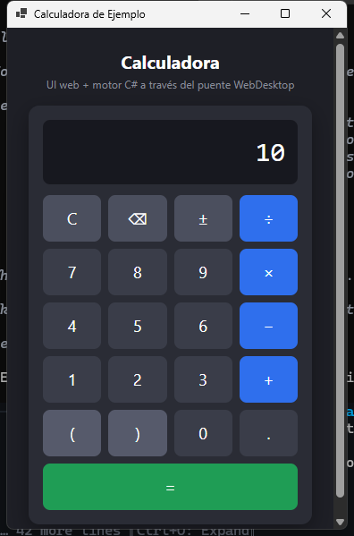
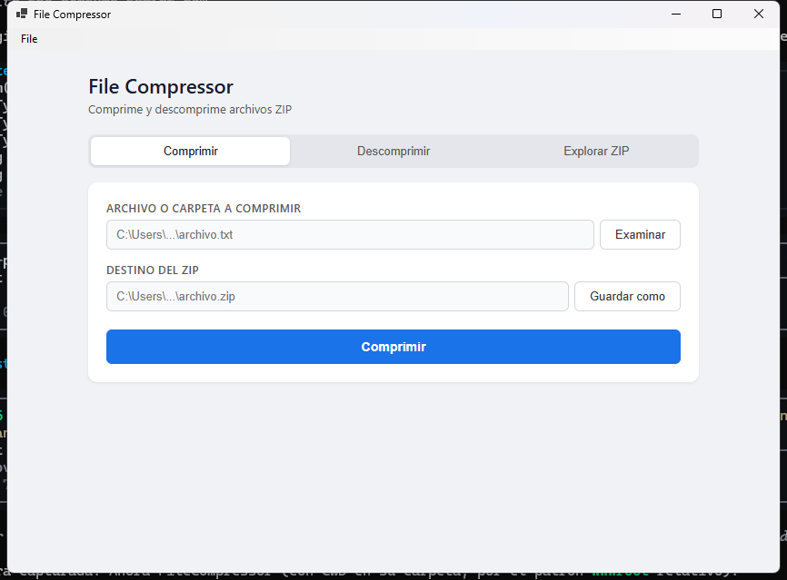
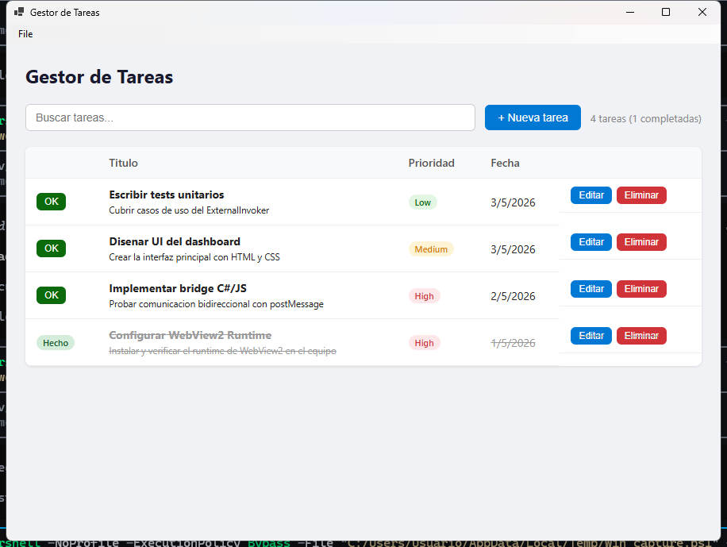

# WebDesktop

WebDesktop is a .NET framework for building Windows desktop applications using web technologies (HTML, CSS, and JavaScript). It wraps the WebView2 control and provides a bidirectional communication bridge between C# and JavaScript.

## Features

- Full-screen WebView2 window with native Windows Forms integration
- Bidirectional C# to JavaScript communication bridge
- Native dialog support (message boxes, file open/save, folder selection)
- Virtual host mapping for serving local static files
- Global script and style injection
- System tray icon support
- Customizable WebView2 environment configuration
- Shared WebView2 environment across windows
- Menu bar integration

## Requirements

- Windows 10 or later (or Windows Server 2019 or later)
- [WebView2 Runtime](https://developer.microsoft.com/en-us/microsoft-edge/webview2/) (Evergreen Runtime recommended)
- .NET 9.0 SDK or later
- Visual Studio 2022 (recommended) or any compatible IDE

## Installation

### From source

Clone the repository and build:

```bash
git clone https://github.com/yourusername/webdesktop.git
cd webdesktop
dotnet build
```

## Quick Start

```csharp
using WebDesktop.Core;

class Program
{
    [STAThread]
    static void Main()
    {
        Application.EnableVisualStyles();
        Application.SetCompatibleTextRenderingDefault(false);

        var window = new WebWindow("My App", 1024, 768);

        window.Shown += async (_, _) =>
        {
            await window.InitializeAsync();

            // Register a C# handler callable from JavaScript
            window.Externo.RegisterHandler("greet", (json) =>
            {
                var name = json;
                return Task.FromResult(System.Text.Json.JsonSerializer.Serialize(
                    new { message = $"Hello, {name}!" }));
            });

            // Serve local files from wwwroot folder
            window.SetAssetFolder("wwwroot");
            await window.NavigateToAsset("index.html");
        };

        Application.Run(window);
    }
}
```

From your HTML, call C# methods using:

```javascript
const result = await window.WebDesktop.invoke("greet", "World");
```

## Project Structure

```
WebDesktop/
├── WebDesktop.Core/              # Core framework library
│   ├── Bridge/
│   │   ├── IJSExecutor.cs        # Interface for JavaScript execution
│   │   └── JavaScriptBridge.cs   # C# to JS communication bridge
│   ├── WebWindow.cs              # Main window with WebView2 integration
│   ├── WebView2Configuration.cs  # WebView2 environment configuration
│   └── WebDesktopException.cs    # Custom exception type
├── WebDesktop.Core.Tests/        # Unit tests (NUnit + Moq)
├── FileCompressor/               # Example: file compression application
│   ├── Services/
│   │   ├── CompressionService.cs
│   │   ├── FileInfoService.cs
│   │   └── ResponseHelper.cs
│   └── wwwroot/                  # Static frontend files
├── CalculatorApp/                # Example: calculator application
│   ├── Calculadora.cs            # C# evaluation engine (recursive descent parser)
│   └── wwwroot/                  # Static frontend files
├── TestApp/                      # Example: task manager application
│   └── wwwroot/                  # Static frontend files
├── screenshots/                  # Screenshots of the example applications
└── WebDesktop.sln                # Visual Studio solution file
```

## Usage

### Creating a window

```csharp
// Default configuration
var window = new WebWindow("Title", 800, 600);

// With custom WebView2 configuration
var config = new WebView2Configuration
{
    AllowDevTools = false,
    IsScriptEnabled = true,
    UserDataFolder = "./webview-data"
};
var window = new WebWindow(config, "Title", 800, 600);
```

### Communication bridge

**From C# to JavaScript:**

```csharp
// Execute any JavaScript
await window.ExecuteScriptAsync("alert('Hello from C#!');");
```

**From JavaScript to C#:**

```csharp
// Register a handler in C#
window.Externo.RegisterHandler("myMethod", async (jsonArgs) =>
{
    // Process and return JSON
    return System.Text.Json.JsonSerializer.Serialize(new { result = "ok" });
});
```

```javascript
// Call it from JavaScript
const response = await window.WebDesktop.invoke("myMethod", { key: "value" });
```

### Native dialogs

Built-in dialog handlers are available from JavaScript:

```javascript
// Message box
const msg = await window.WebDesktop.invoke("__dialog.showMessage", {
    text: "File saved successfully",
    caption: "Success",
    buttons: "OK",
    icon: "Info"
});

// Open file dialog
const file = await window.WebDesktop.invoke("__dialog.openFile", {
    filter: "Text files (*.txt)|*.txt|All files (*.*)|*.*",
    multi: false
});

// Save file dialog
const save = await window.WebDesktop.invoke("__dialog.saveFile", {
    filter: "PDF files (*.pdf)|*.pdf",
    defaultName: "document.pdf"
});

// Folder selection dialog
const folder = await window.WebDesktop.invoke("__dialog.selectFolder", {});
```

### System tray

```csharp
window.EnableTrayIcon("My Application", "app.ico");
```

### Menu bar

```csharp
window.AddMenu("File");
var fileMenu = (ToolStripMenuItem)window.MainMenuStrip.Items[0];
window.AddMenuItem(fileMenu, "Open", (_, _) => { /* handle click */ });
window.AddMenuItem(fileMenu, "Exit", (_, _) => Application.Exit());
```

## Examples

Three example applications are included:

- **CalculatorApp**: A calculator whose UI is web and whose engine runs in C# through the bridge (supports + - * / %, parentheses and unary minus).

  

- **FileCompressor**: A file compression tool using System.IO.Compression with a web frontend.

  

- **TestApp**: A task management application with SQLite database and CRUD operations.

  

To run an example:

```bash
cd FileCompressor
dotnet run
```

## Building

```bash
dotnet build
```

## Running Tests

```bash
dotnet test
```

## License

This project is licensed under the MIT License. See the [LICENSE](LICENSE) file for details.
